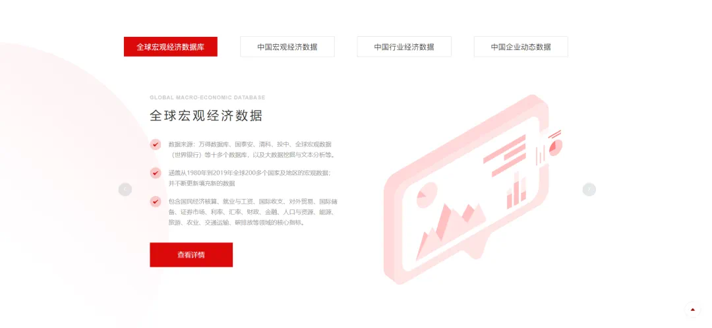
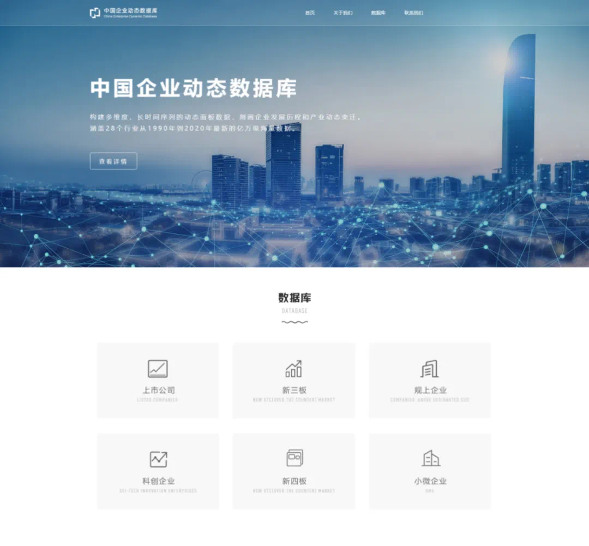
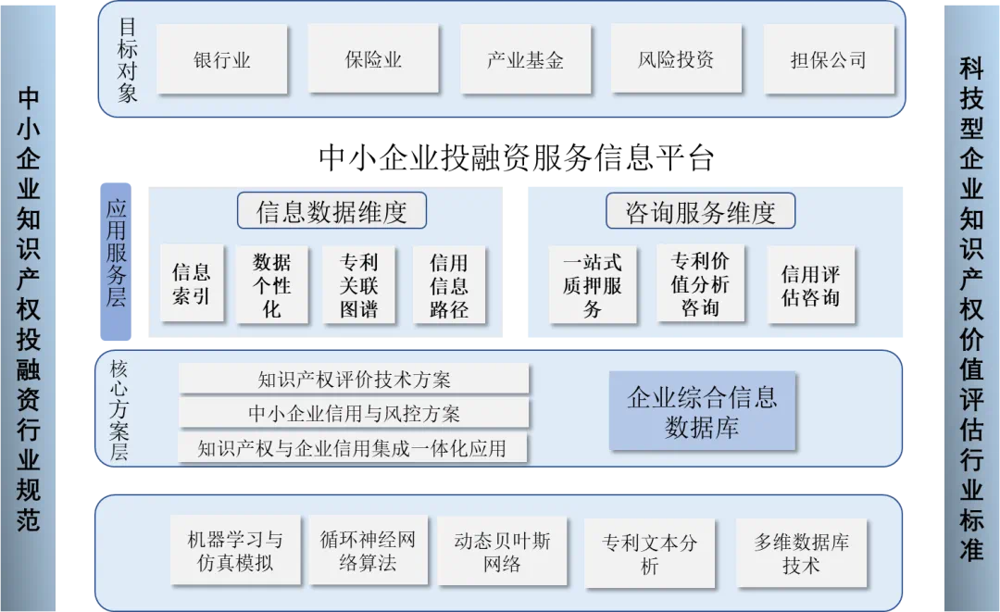
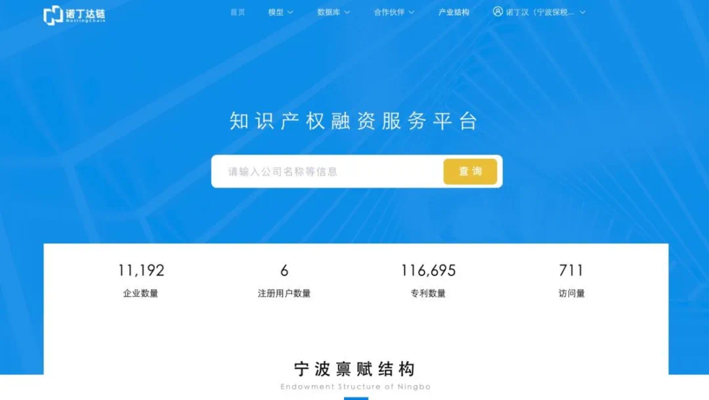

## Project Overview

This project is part of the Major Special Project for Scientific and Technological Innovation 2025 in a certain city, aiming to develop an integrated technology for investment and financing based on enterprise credit and intellectual property evaluation, and promote its practical application.

## Project Background and Necessity

### Background

With the in-depth implementation of scientific and technological innovation plans and the continuous upgrading of industrial structures, the demand for financial services from small and medium-sized enterprises, especially technology-based small and medium-sized enterprises, is increasing. Meanwhile, the rapid development of financial technology applications has provided possibilities for innovating financial service models.

### Necessity

1. **Needs of Scientific and Technological Innovation Planning and Industrial Structure Upgrading**: This project helps improve the financing efficiency of technology-based small and medium-sized enterprises and promotes the upgrading of industrial structures.
2. **Endogenous Demand for Financial Services of Small and Medium-sized Enterprises**: It meets the demand for financial services from small and medium-sized enterprises, particularly technology-based ones, and promotes their healthy development.
3. **Overall Development Trend of Financial Technology Applications**: It complies with the development trend of financial technology applications and drives financial innovation.

## Research Status and Development Trends

### Research Status

1. **Development of Intellectual Property Financing Services**: Currently, there are some intellectual property financing services available, but those targeting technology-based small and medium-sized enterprises are still inadequate.
2. **Enterprise Credit Evaluation**: Traditional credit evaluation methods mostly rely on subjective scoring and financial performance, lacking sufficient evaluation of intangible assets.

### Development Trends

1. **Intellectual Property Financing Services for Small and Medium-sized Enterprises**: More emphasis will be placed on the value assessment of intellectual property and financing innovation.
2. **Credit Evaluation of High-tech Small and Medium-sized Enterprises**: More non-financial indicators will be introduced to improve evaluation accuracy.

## Project Objectives and Content

### Overall Objective

Develop financing models based on intellectual property, enterprise credit evaluation models, and risk control models; establish sub-databases for intellectual property information and comprehensive enterprise information; build an intellectual property financing service platform; and formulate relevant service norms and systems.

### Main Research Content

1. **Development of Technical Solutions Based on Intellectual Property Evaluation**
2. **Development of Enterprise Credit Evaluation and Risk Control Solutions**
3. **Development of Integrated Application Solutions for Intellectual Property and Enterprise Credit Risk Control**
4. **Development of Intellectual Property Financing Service Platform and Database Construction**

## Key Technologies and Innovation Points

### Key Technologies

1. **Technologies Related to Intellectual Property Financing**
2. **Technologies Related to Credit Evaluation**
3. **Technologies Related to Enterprise Risk Control**
4. **Real-time Supervision Technologies**
5. **Technologies for Constructing Comprehensive Databases**

### Innovation Points

1. **Technological Innovation**: Introduce analytical models such as dynamic Bayesian networks and Markov chains to sort out the risk transmission mechanisms of technology-based small and medium-sized enterprises.
2. **Model Innovation**: Build an integrated evaluation system for intellectual property and enterprise credit, innovating financing service models.

## Database construction

### The global macroeconomic database

The global macroeconomic database integrates data resources from more than ten databases such as Wind, Guotai'an, Zero2IPO, CVSource, and the World Bank, with over 780,000 data entries spanning from 1975 to 2020. It covers macro-level indicators for more than 200 countries and regions worldwide, encompassing core indicators in areas such as national economic accounting, employment and wages, balance of payments, foreign trade, international reserves, securities markets, interest rates, exchange rates, finance, population and resources, energy, tourism, agriculture, transportation, and carbon emissions.

### The Chinese Enterprise Dynamic Data

## Overall Architecture

1. **Development of an Evaluation Technology Solution Based on Intellectual Property**:
   Starting with patent information data, this project leverages big data intelligent mining and analysis technology, combined with traditional evaluation tools and financial technology means such as machine learning, to break through key technologies in intellectual property evaluation. It establishes a multi-dimensional dynamic evaluation system to improve the accuracy of patent valuation and address issues such as information asymmetry, excessively high costs of capital acquisition, and inadequate financial service channels.
2. **Development of a Corporate Credit and Risk Control Solution**:
   This project aims to break through key technologies in credit evaluation and risk control for small and medium-sized enterprises (SMEs). Based on theoretical research results in credit evaluation and risk control for technology-based micro, small, and medium-sized enterprises, it utilizes two typical case databases (for credit evaluation and risk control) as the foundation for qualitative analysis. Supported by credit evaluation models and risk control models for quantitative analysis, it develops an integrated solution for credit evaluation and risk control tailored for these enterprises.
3. **Development of an Integrated Application Solution for Intellectual Property and Corporate Credit Risk Control**:
   This project seeks to break through key technologies for integrating intellectual property evaluation and credit risk control. By cross-verifying intellectual property data, credit evaluation data, and risk control data, it forms an integrated application solution comprising comprehensive credit evaluation, comprehensive risk control, a multi-dimensional information verification system, and dynamic adjustment applications. Building upon the accumulated data from typical cases in risk control and credit evaluation, it conducts dynamic simulations and iterations of the comprehensive solution embedded with core intellectual property evaluation technology, laying the technical foundation and application blueprint for the subsequent development and construction of investment and financing platforms.

## Platform Display

